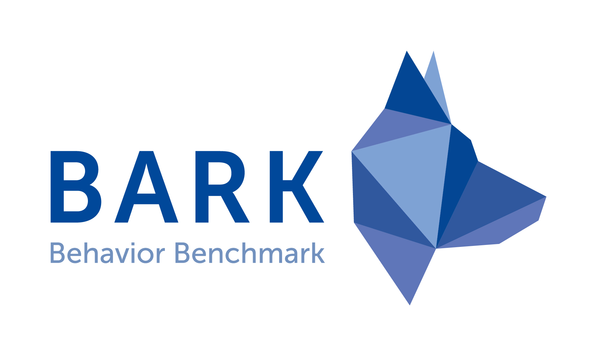
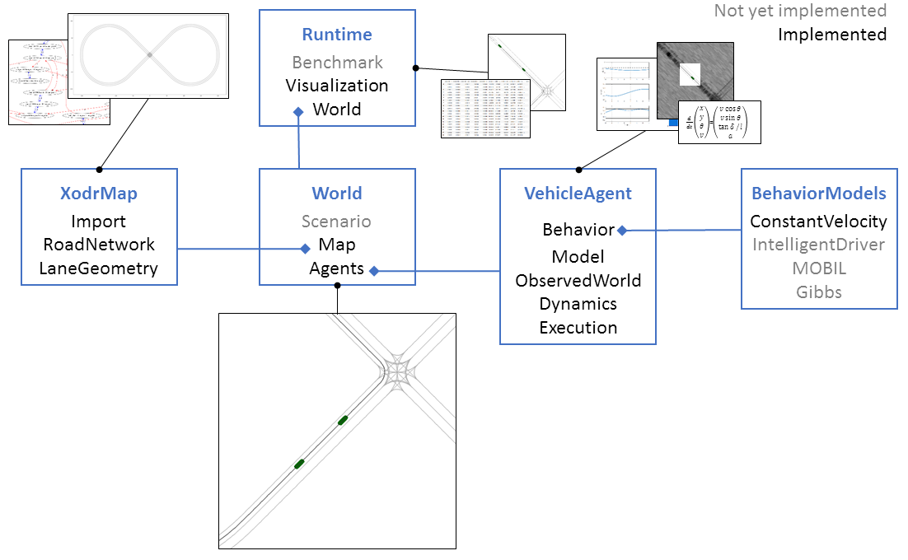
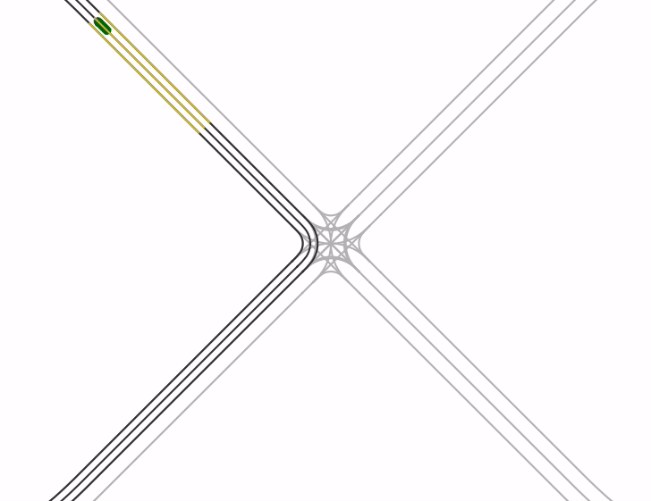

# BARK - a tool for **B**ehavior benchm**Ark**ing
BARK provides a semantic simulation tool/framework for autonomous agents with a special focus on autonomous driving.

## Need
Autonomous agents, such as traffic participants, need to make decisions in uncertain environments having many agents, which might be cooperative or possibly adversarial. Research in decision making brought up many approaches from the fields of machine learning, game, and control theory. However, transferring approaches to real-world applications, such as self-driving cars introduces a number of challenges, that prevent such systems to safely enter the market. One of the remaining challenges is a quantification of the expected performance of behavior generation approaches under true environmental conditions, e.g. unknown true behavior of other participants or uncertainty regarding the observations of the environment. This challenge is currently approached by driving endless amounts of kilometers in simulation-based and in recorded scenarios. However, such an approach impedes getting insights into the causes of performance differences of the evaluated approaches. Implemented improvements of an approach require frequent re-evaluation over the whole set of scenarios. To make behavior generation approaches ready for the real-world, an analysis framework should be established which can accurately model the divergence between real behavior of other participants and the behaviors generated by models (algorithms). Such a framework would allow for a more thorough investigation of the expected performance of behavior generation approaches under true environmental conditions. To make the claims of simulation-based performance results transferable to reality, benchmark scenario specifications must be selected according to certain coverage criteria and agreed on by the whole community of researchers and industry. BARK tries to tackle and solve the above mentioned challenges and problems.

## BARK Concept
BARK is a multi-agent simulation environment tailored towards the use case of autonomous systems, with a special focus on autonomous driving. Each agent is controlled by a behavior specification in form of a behavioral model. Behavioral models can be easily exchanged and used both for simulation of other participants and/or as behavior prediction on the behavior generation side. For this, Bark defines abstract interfaces for the development of own behavioral models but also delivers several state-of-the-art behavioral models based on machine-learning and classical approaches. By additionally having a set of metrics and functions that evaluate individual components, BARK acts as a comprehensive framework for the development and verification of behavior generation approaches.

## BARK Architecture
BARKs modular architecture is as follows: 

## Quick-Start
A quick guide on how to get started with BARK. Make sure to have all prerequesites installed before following the other steps.

### Prerequesites
* Bazel (requires Java) (please use the newest stable version)
* Python3
* virtualenv (Virtual environment)

### Installation on Ubuntu/MacOS
1. [Clone the repository](https://git.fortiss.org/bark-simulator/bark), change to base repository directory 
2. `bash install.sh`: this will create a virtual python environment (located in python/venv) and install all necessary python dependencies.
2. `source dev_into.sh`: this will activate the virtual environment (keep this in mind for the future: each time you use Bazel, even beyond this installation, be sure to have run this command beforehand)
3. `bazel build //...`: this will build the whole library and test cases (specific test cases or specify individual modules can be built with e.g `bazel build //modules/world/tests:world_test`, see the documentation of Bazel for more insights).
4. `bazel test //...`: this will run all specified tests (individual tests can be executed using, e.g. for the C++ tests `//modules/world/tests:world_test` and for the python test cases `bazel test //python:name_of_module`, e.g `bazel test //python:importer_test`).

### Run Examples
In order to get started with BARK, we provide several examples that show the basic functionality. All examples are found within the `/examples`-directory.

To run the [OpenDrive example map "standard crossing"](http://www.opendrive.org/download.html) example use the command `bazel run //examples:od8_const_vel_one_agent` (make sure to be in the virtual environment!) which outputs:

## Documentation

A detailed documentation is found under https://bark-simulator.readthedocs.io/en/latest/about.html
